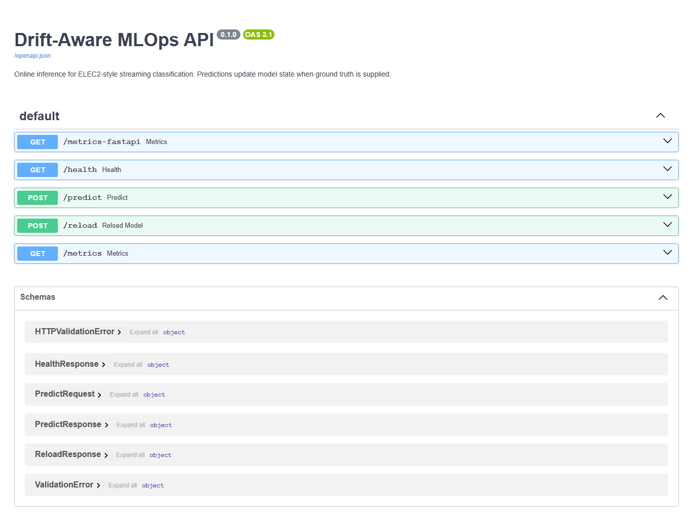
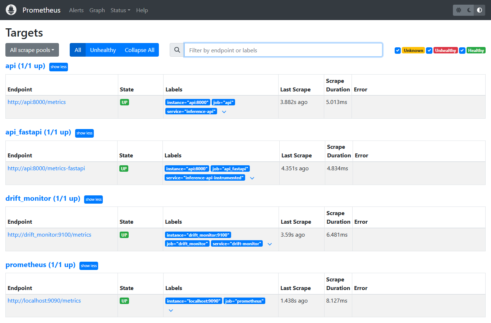
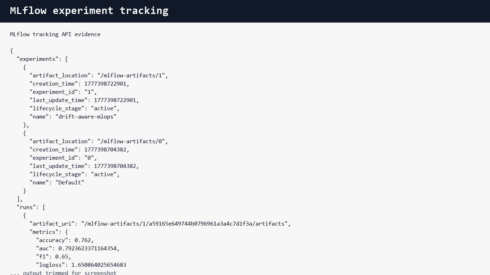
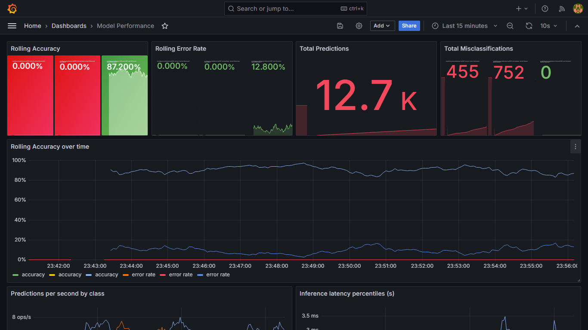
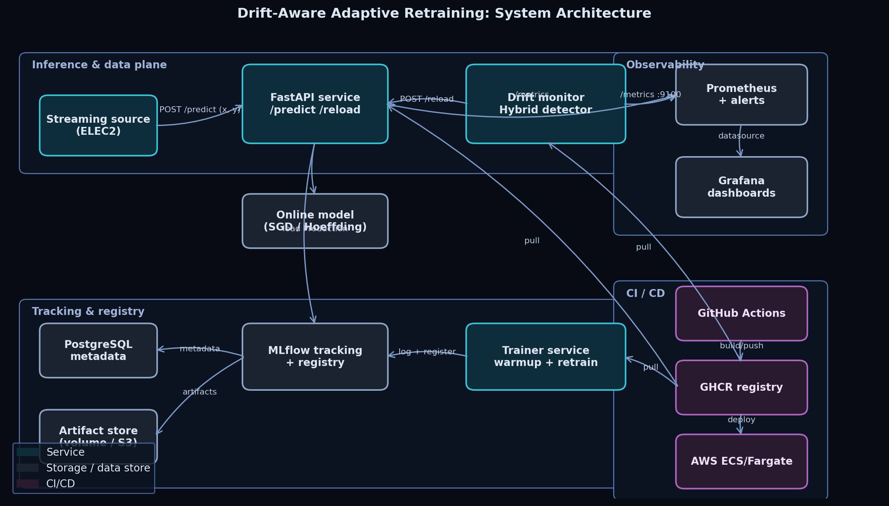

# Drift-Aware Adaptive Retraining MLOps Pipeline

[](https://github.com/abubakarshahid16/drift-aware-mlops-pipeline/actions/workflows/ci.yml)
[](https://github.com/abubakarshahid16/drift-aware-mlops-pipeline/actions/workflows/docker.yml)
[](https://github.com/abubakarshahid16/drift-aware-mlops-pipeline/actions/workflows/paper.yml)


An end-to-end MLOps research project for streaming classification under concept drift. It includes a real deployable system, a research contribution, experiment tracking, monitoring dashboards, CI/CD automation, an IEEE paper, screenshots, and a demo video.

Repository: [github.com/abubakarshahid16/drift-aware-mlops-pipeline](https://github.com/abubakarshahid16/drift-aware-mlops-pipeline)

## Elevator Pitch

Production ML models fail when the world changes. This project builds a complete MLOps pipeline that detects concept drift, exposes drift through Prometheus/Grafana, logs model experiments in MLflow, and triggers adaptive model reloads. The research contribution is **HybridDD**, a detector that combines performance drift and distribution drift signals.

## Table Of Contents

- [Demo First](#demo-first)
- [What The Project Proves](#what-the-project-proves)
- [One Command Run](#one-command-run)
- [Step By Step Evaluation Path](#step-by-step-evaluation-path)
- [Architecture](#architecture)
- [Research Contribution](#research-contribution)
- [Repository Map](#repository-map)
- [Metrics And Dashboards](#metrics-and-dashboards)
- [Experiments](#experiments)
- [Validation](#validation)
- [Assignment Rubric](#assignment-rubric)
- [Documentation Index](#documentation-index)

## Demo First

The repository includes proof artifacts so it can be reviewed even before running Docker.

| Artifact | Link |
|---|---|
| Proper localhost walkthrough | [Download MP4 from GitHub raw](https://github.com/abubakarshahid16/drift-aware-mlops-pipeline/raw/main/demo_artifacts/live_localhost_walkthrough.mp4) |
| Smaller browser video | [Download WebM from GitHub raw](https://github.com/abubakarshahid16/drift-aware-mlops-pipeline/raw/main/demo_artifacts/live_localhost_walkthrough.webm) |
| Demo video file | [demo_artifacts/live_localhost_walkthrough.mp4](demo_artifacts/live_localhost_walkthrough.mp4) |
| Demo preview page | [demo_artifacts/DEMO_VIDEO.md](demo_artifacts/DEMO_VIDEO.md) |
| Video thumbnail | [demo_artifacts/youtube_thumbnail.png](demo_artifacts/youtube_thumbnail.png) |
| IEEE paper PDF | [paper/main.pdf](paper/main.pdf) |
| IEEE paper source | [paper/main.tex](paper/main.tex) |
| Final presentation deck | [presentation/Drift-Aware-MLOps-Final-Defense.pptx](presentation/Drift-Aware-MLOps-Final-Defense.pptx) |
| Screenshots | [demo_artifacts/screenshots](demo_artifacts/screenshots) |
| Demo guide | [docs/DEMO_GUIDE.md](docs/DEMO_GUIDE.md) |
| Video title, description, keywords | [docs/VIDEO_DESCRIPTION.md](docs/VIDEO_DESCRIPTION.md) |

The primary walkthrough is a real browser recording of the local stack running at `localhost`: FastAPI, `/health`, live `/predict`, Prometheus, MLflow, and Grafana. GitHub sometimes does not preview MP4 files inside the code viewer. If that happens, click **Raw**, the download icon, or use the direct raw links above.


### Demo Preview

| FastAPI | Prometheus |
|---|---|
|  |  |

| MLflow | Grafana |
|---|---|
|  |  |

## What The Project Proves

This project demonstrates practical understanding of:

- **Experiment tracking:** MLflow logs training runs, metrics, parameters, and artifacts.
- **Model packaging:** Docker images package API, trainer, drift monitor, and MLflow.
- **CI/CD automation:** GitHub Actions run linting, tests, smoke experiments, Docker builds, scans, and optional deployment.
- **Monitoring and logging:** Prometheus metrics and Grafana dashboards track model health, latency, drift, and retraining.
- **Deployment:** Docker Compose runs the full system locally; optional AWS ECS workflow is included.
- **Research rigor:** The benchmark compares multiple drift detectors using accuracy, latency, throughput, delay, false positives, miss rate, retrains, and statistical tests.

## One Command Run

Prerequisites:

- Docker Desktop
- Git
- Python 3.10 to 3.12 for local development

Start the complete stack:

```bash
docker compose up -d --build
```

Open:

| Service | URL | Login |
|---|---|---|
| FastAPI docs | http://localhost:8000/docs | none |
| Prometheus | http://localhost:9090 | none |
| Grafana | http://localhost:3000 | `admin` / `admin` |
| MLflow | http://localhost:5000 | none |
| Drift metrics | http://localhost:9100/metrics | none |

Stop:

```bash
docker compose down
```

Full setup instructions: [docs/SETUP.md](docs/SETUP.md)

## Step By Step Evaluation Path

For a teacher, examiner, or reviewer, this is the fastest path:

1. Read the project problem and architecture in this README.
2. Watch [demo_artifacts/live_localhost_walkthrough.mp4](demo_artifacts/live_localhost_walkthrough.mp4).
3. Open [docs/RUBRIC_MAPPING.md](docs/RUBRIC_MAPPING.md) to see every requirement mapped to files.
4. Run `docker compose up -d --build`.
5. Open FastAPI at http://localhost:8000/docs and test `/predict`.
6. Open MLflow at http://localhost:5000 and inspect training runs.
7. Open Prometheus at http://localhost:9090/targets and verify scrape targets.
8. Open Grafana at http://localhost:3000 and inspect dashboards.
9. Inspect `src/drift/detectors.py` for HybridDD.
10. Inspect [paper/main.pdf](paper/main.pdf), `paper/main.tex`, and `paper/refs.bib` for the research deliverable.

Presentation script: [docs/DEMO_GUIDE.md](docs/DEMO_GUIDE.md)

## Smoke Test

```bash
curl http://localhost:8000/health

curl -X POST http://localhost:8000/predict \
  -H "Content-Type: application/json" \
  -d '{"features":[0.1,0.2,0.3,0.4,0.5,0.6,0.7,0.8],"label":1}'
```

Expected:

- `/health` returns `status=ok`.
- `/predict` returns prediction, probability, model version, and latency.
- Prometheus targets are `UP`.
- Grafana dashboards load.
- MLflow contains warmup training runs.

API details: [docs/API_REFERENCE.md](docs/API_REFERENCE.md)

## Architecture



The system is divided into four planes:

1. **Inference plane:** FastAPI serves `/predict`, `/health`, `/reload`, `/metrics`, and `/metrics-fastapi`.
2. **Tracking plane:** MLflow stores experiments, metrics, parameters, and model artifacts.
3. **Monitoring plane:** Prometheus scrapes API and drift-monitor metrics; Grafana renders dashboards.
4. **CI/CD plane:** GitHub Actions run linting, tests, smoke experiments, Docker builds, scans, paper builds, and optional deployment.

Architecture guide: [docs/ARCHITECTURE.md](docs/ARCHITECTURE.md)

## Research Contribution

The research contribution is **HybridDD**, a hybrid drift detector that combines:

- DDM, a performance-based detector that reacts to increasing prediction error.
- KSWIN, a distribution-based detector that reacts to feature shift.
- A consensus rule to reduce false positives.
- A confidence override for severe model degradation.
- A cooldown rule to prevent retraining storms.

Research guide: [docs/RESEARCH.md](docs/RESEARCH.md)

Core detector implementation: [src/drift/detectors.py](src/drift/detectors.py)

## Repository Map

```text
.
|-- .github/workflows/          # CI, Docker build, optional deploy, paper build
|-- architecture/               # Mermaid and rendered architecture diagrams
|-- data/                       # Dataset placeholders and feature metadata
|-- demo_artifacts/             # Demo video and screenshots
|-- deploy/
|   |-- docker/                 # Dockerfiles for API, trainer, drift monitor, MLflow
|   |-- grafana/                # Provisioned dashboards and datasources
|   `-- prometheus/             # Scrape config and alert rules
|-- docs/                       # Setup, research, monitoring, API, troubleshooting, rubric
|-- experiments/results/        # Benchmark result files
|-- notebooks/                  # Walkthrough notebook
|-- paper/                      # IEEE paper PDF, source, figures, bibliography
|-- scripts/                    # Reproducibility and demo helper scripts
|-- src/                        # Application, model, drift, monitoring, pipeline code
`-- tests/                      # Unit and API tests
```

## Main Components

| Component | Files | Purpose |
|---|---|---|
| API service | `src/api/` | Inference, health, reload, and metrics |
| Online models | `src/models/` | SGD, logistic baseline, Hoeffding tree adapters |
| Drift detectors | `src/drift/` | ADWIN, DDM, EDDM, KSWIN, Page-Hinkley, HybridDD |
| Training pipeline | `src/pipelines/train.py` | Warmup training and MLflow logging |
| Experiment harness | `src/pipelines/experiment.py` | Prequential benchmark and statistics |
| Drift monitor | `src/monitoring/drift_service.py` | Drift metrics and adaptive reload loop |
| Monitoring | `deploy/prometheus/`, `deploy/grafana/` | Scraping, alerts, dashboards |
| CI/CD | `.github/workflows/` | Tests, lint, Docker, paper, optional deploy |

## Metrics And Dashboards

The API and drift monitor expose:

- `ml_predictions_total`
- `ml_prediction_errors_total`
- `ml_drift_events_total`
- `ml_retrains_total`
- `ml_rolling_accuracy`
- `ml_rolling_error_rate`
- `ml_drift_severity`
- `ml_model_version_info`
- `ml_inference_latency_seconds`
- `ml_online_update_latency_seconds`

Dashboards:

- Model Performance
- Drift And Adaptive Retraining
- Infrastructure And API Health

Monitoring guide: [docs/MONITORING.md](docs/MONITORING.md)

## Experiments

Quick smoke experiment:

```bash
python -m src.pipelines.experiment \
  --no-mlflow \
  --seeds 42 \
  --models sgd_logistic \
  --detectors ddm hybrid \
  --streams sea \
  --n-samples 1000
```

Full benchmark:

```bash
python -m src.pipelines.experiment \
  --seeds 42 1337 2024 \
  --models sgd_logistic hoeffding_tree \
  --detectors adwin ddm eddm kswin page_hinkley hybrid \
  --streams elec2 sea hyperplane
```

Results guide: [docs/RESULTS.md](docs/RESULTS.md)

## Validation

Local validation performed:

```text
pytest                       36 passed
ruff check src tests         passed
ruff format --check src tests passed
docker compose up -d --build passed
```

Verified services:

- FastAPI
- MLflow
- Prometheus
- Grafana
- Drift monitor
- Postgres-backed MLflow store

## Assignment Rubric

| Requirement | Status | Evidence |
|---|---|---|
| MLflow tracking | Complete | `src/pipelines/train.py`, MLflow service, screenshot |
| Docker containerization | Complete | `docker-compose.yml`, `deploy/docker/` |
| Prometheus metrics | Complete | `src/api/metrics.py`, `deploy/prometheus/` |
| Grafana dashboard | Complete | `deploy/grafana/dashboards/` |
| CI/CD | Complete | `.github/workflows/` |
| Research paper | Complete | `paper/main.pdf`, `paper/main.tex`, `paper/refs.bib` |
| Literature review | Complete | 19 references in `paper/refs.bib` |
| Experimental validation | Complete | `src/pipelines/experiment.py`, `experiments/results/` |
| Architecture diagram | Complete | `architecture/architecture.png` |
| Demo evidence | Complete | `demo_artifacts/` |
| Final presentation | Complete | `presentation/Drift-Aware-MLOps-Final-Defense.pptx` |

Full rubric mapping: [docs/RUBRIC_MAPPING.md](docs/RUBRIC_MAPPING.md)

## Documentation Index

| Document | Purpose |
|---|---|
| [docs/SETUP.md](docs/SETUP.md) | Installation and run instructions |
| [docs/DEMO_GUIDE.md](docs/DEMO_GUIDE.md) | Presentation walkthrough |
| [docs/ARCHITECTURE.md](docs/ARCHITECTURE.md) | System design and data flow |
| [docs/MONITORING.md](docs/MONITORING.md) | Metrics, dashboards, alerts |
| [docs/API_REFERENCE.md](docs/API_REFERENCE.md) | API endpoints and examples |
| [docs/RESEARCH.md](docs/RESEARCH.md) | Research problem, RQs, methods |
| [docs/RESULTS.md](docs/RESULTS.md) | Results files and interpretation |
| [docs/CI_CD.md](docs/CI_CD.md) | GitHub Actions workflows |
| [docs/TROUBLESHOOTING.md](docs/TROUBLESHOOTING.md) | Common issues and fixes |
| [docs/RUBRIC_MAPPING.md](docs/RUBRIC_MAPPING.md) | Assignment checklist |
| [docs/VIDEO_DESCRIPTION.md](docs/VIDEO_DESCRIPTION.md) | Optimized demo video title, description, and keywords |

## Important Note

The checked-in result files are suitable for fast review and smoke validation. The paper includes representative full-benchmark values, and the full benchmark command is provided for reproducibility. For a final publication-style submission, rerun the full benchmark and commit the refreshed `experiments/results/*` files.

## License

MIT
