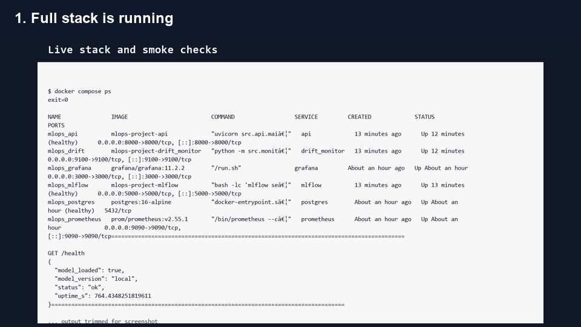

# Demo Video

GitHub may show the MP4 file page with this message:

```text
Sorry about that, but we can't show files that are this big right now.
```

That does **not** mean the video is missing. It means GitHub is not previewing the MP4 inside the repository file viewer.

## Watch Or Download

- [Download / open the MP4 directly](https://github.com/abubakarshahid16/drift-aware-mlops-pipeline/raw/main/demo_artifacts/mlops_live_demo.mp4)
- [Open the MP4 file page](mlops_live_demo.mp4)
- [View screenshots](screenshots/)

## Preview



## What The Video Shows

1. Docker Compose stack and smoke checks.
2. FastAPI Swagger documentation.
3. API health response.
4. Prediction API response.
5. Prometheus targets.
6. Prometheus metric evidence.
7. MLflow experiment tracking evidence.
8. Grafana model performance dashboard.
9. Grafana drift and retraining dashboard.
10. Grafana infrastructure dashboard.

## Video Metadata

- File: `mlops_live_demo.mp4`
- Duration: 30 seconds
- Resolution: 1280x720
- Size: about 6.25 MB
